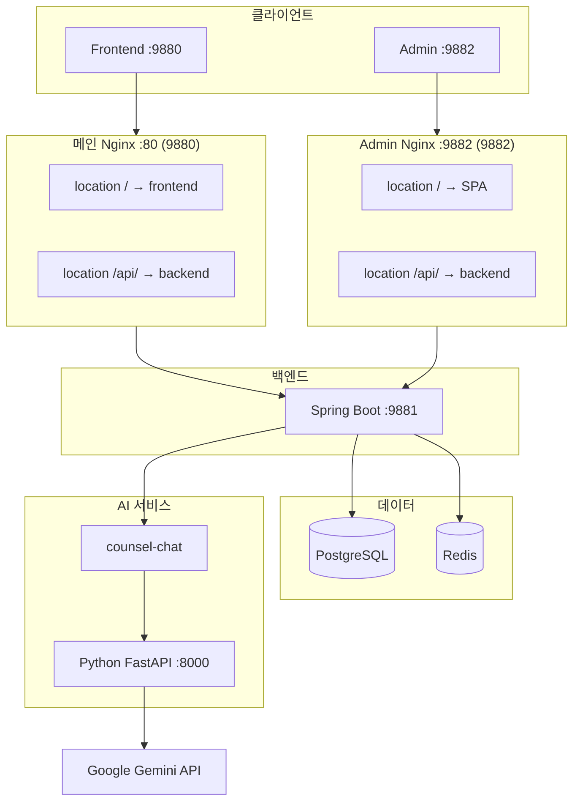
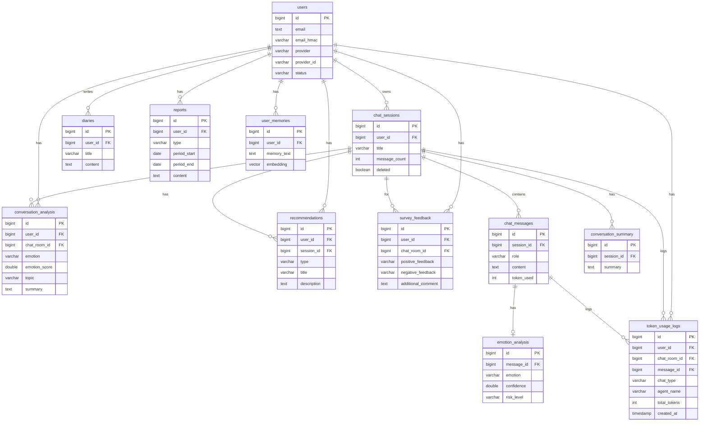

# AI 심리상담 앱 백엔드 포트폴리오
https://onoff-m.com/

---

## 목차

1. [프로젝트 개요](#1-프로젝트-개요)
2. [기술 스택](#2-기술-스택)
3. [시스템 아키텍처](#3-시스템-아키텍처)
4. [ERD / 도메인 설계](#4-erd--도메인-설계)
5. [트러블슈팅](#5-트러블슈팅)

---

## 1. 프로젝트 개요

### 서비스 한 줄 소개

AI 챗봇과 대화를 통해 감정을 정리하고 심리적 지원을 받을 수 있는 웹 기반 상담 서비스.

### 프로젝트 기간

- 2025년 1월 ~ 현재 (진행 중)

### 개발 범위

| 영역 | 내용 |
|------|------|
| **백엔드 설계/구현** | Spring Boot 기반 REST API, JPA 엔티티·Repository, 서비스 레이어 설계 |
| **인증/인가** | OAuth2 소셜 로그인(카카오·네이버·구글), JWT 발급·검증, 관리자 ID/PW 로그인(BCrypt) |
| **배포/운영** | Docker Compose, Nginx 리버스 프록시, PostgreSQL init-db 스크립트 |
| **관리자 기능** | 회원·채팅·일기·리포트·설문·토큰·쿠폰·입장문·인사말 CRUD, KPI 대시보드 API 설계 |
| **데이터 보호** | 이메일 AES-256 암호화, HMAC 검색, 상담 데이터 소유권 검증 |
| **AI 연동** | Python HTTP/SSE 호출, 컨텍스트(Short/Summary/Long-term Memory) 수집·전달 |
| **AI 서비스 개발** | Python FastAPI + Gemini 연동, Agent 오케스트레이션(Emotion→Safety→Therapy→Recommendation), 리포트/인사말 생성 API |

---

## 2. 기술 스택

| 영역 | 기술 | 선택 이유 |
|------|------|-----------|
| **Backend** | Spring Boot 3.5, Java 21 | I/O Inbound 시스템에 적합 |
| **AI 연동** | SSE, Python FastAPI, Gemini API | HTTP/스트리밍 통신, 상담·리포트·임베딩 API |
| **Database** | PostgreSQL 16 + pgvector | 관계형 + 벡터 검색(Long-term Memory) 단일 DB로 운영 |
| **캐시** | Redis | Short Memory(세션별 최근 메시지) 관리 |
| **인증** | Spring Security, OAuth2 Client, JWT(jjwt) | 소셜 로그인 + API용 Stateless JWT |
| **배포** | Docker Compose, Nginx | 로컬·운영 환경 분리, 리버스 프록시로 API·OAuth2 라우팅 |

---

## 3. 시스템 아키텍처

### 전체 구조

---

## 4. ERD / 도메인 설계

### 핵심 엔티티 관계

### 설계 판단 근거

| 설계 | 이유 |
|------|------|
| **메시지 저장소 선택** | Redis: 메모리 부담 우려, MongoDB: 아키텍처 복잡성 증가 → PostgreSQL 단일 DB로 관리 편의성 확보 |
| **user_memories (pgvector)** | Long-term Memory 검색을 위해 임베딩 벡터 저장 |

---

## 5. 트러블슈팅

### 5.1 스트리밍 3-hop 파이프라인에서의 정합성

| 항목 | 내용 |
|------|------|
| 문제 | Python → Spring WebClient → SseEmitter → Client 3단계 스트리밍에서, Client가 done 수신 전에 끊기면 assistant 메시지·감정·추천이 DB에 저장되지 않을 수 있음 |
| 원인 | saveStreamResult()는 done 이벤트의 onDone 콜백에서만 호출됨. Client disconnect로 구독 취소 시 done을 받지 못함 |
| 해결 | user 메시지는 POST 시점에 먼저 저장. assistant 저장 실패 시 불완전 세션만 남도록 허용. (선택) Python 완료 시 Spring callback API 호출 |
| 배운 점 | 긴 파이프라인에서는 완료 보장 지점과 실패 시 복구 전략을 명확히 설계해야 함 |

### 5.2 이원화 아키텍처(Spring + Python)에서 트랜잭션 부재

| 항목 | 내용 |
|------|------|
| 문제 | 메시지 저장(Spring)과 AI 응답 생성(Python)이 다른 서비스라 원자적 트랜잭션 불가 |
| 원인 | 분산 트랜잭션(2PC 등)은 복잡도·성능 때문에 미도입 |
| 해결 | 사용자 메시지 우선 저장으로 최소 보장. AI 실패 시 assistant/분석/추천만 없음. eventual consistency로 수용 |
| 배운 점 | 경계가 나뉜 시스템에서는 어떤 데이터를 최소한 확정할지, 실패 시 어떻게 복구할지 전략을 정해야 함 |

### 5.3 AI 호출의 타임아웃과 블로킹

| 항목 | 내용 |
|------|------|
| 문제 | 비스트리밍 AI 호출(report, greeting, preview 등)이 WebClient + .block()으로 처리되어 Spring 스레드가 AI 응답 시까지 블로킹됨 |
| 원인 | ExternalHttpClient 구현이 .block() 사용. WebClient에 connect/read timeout 미설정 |
| 해결 | 스트리밍 경로는 bodyToFlux + subscribe로 비블로킹. WebClient 타임아웃 설정 및 비스트리밍 API 확대 적용 예정 |
| 배운 점 | 외부 LLM 호출은 지연이 크므로 비동기·타임아웃·전용 스레드 풀 등을 고려해야 함 |

---
