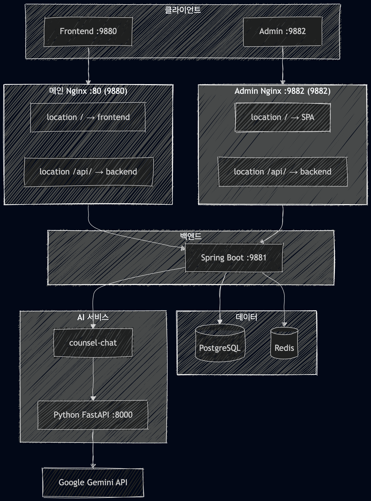
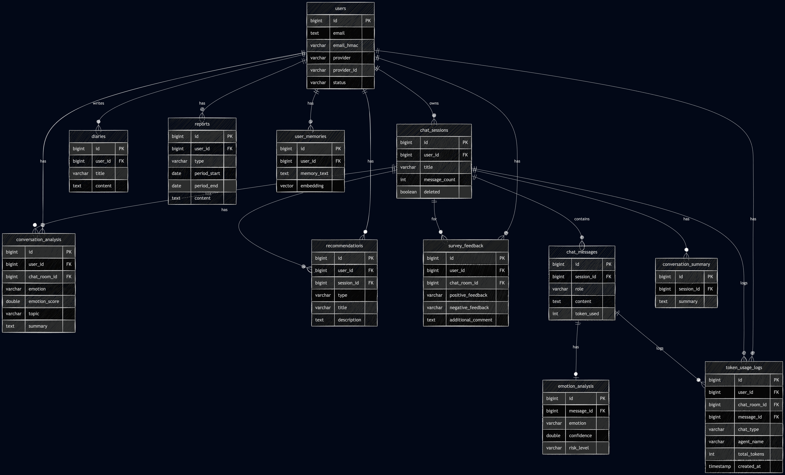

# 🧠 AI 심리상담 서비스 백엔드 포트폴리오

AI 챗봇과 대화를 통해 감정을 정리하고 심리적 지원을 받을 수 있는  
**웹 기반 심리 상담 서비스**의 백엔드 시스템을 설계하고 개발했습니다.

🌐 **Service**  
[https://onoff-m.com](https://onoff-m.com)

---

# 📑 목차

- [1. 프로젝트 개요](#1-프로젝트-개요)
- [2. 기술 스택](#2-기술-스택)
- [3. 시스템 아키텍처](#3-시스템-아키텍처)
- [4. ERD / 도메인 설계](#4-erd--도메인-설계)
- [5. 트러블슈팅](#5-트러블슈팅)

---

# 1. 프로젝트 개요

### 🧾 서비스 소개

AI 챗봇과 대화를 통해 감정을 정리하고  
**심리적 지원과 상담 리포트를 제공하는 웹 서비스**

- AI 상담 채팅
- 감정 분석
- 상담 리포트 생성
- 일기 기록

---

### 📅 프로젝트 기간

```
2025.01 ~ 현재 (진행 중)
```

---

### 👨‍💻 개발 범위

| 영역 | 내용 |
|-----|-----|
| **Backend 설계** | Spring Boot 기반 REST API, JPA 엔티티·Repository 설계 |
| **인증 / 인가** | OAuth2 소셜 로그인(카카오·네이버·구글), JWT 인증 |
| **배포 / 운영** | Docker Compose, Nginx 리버스 프록시 |
| **관리자 시스템** | 회원·토큰·설문·입장문 관리 API |
| **데이터 보호** | 이메일/채팅 암호화 |
| **AI 연동** | Python FastAPI HTTP/SSE 통신 |
| **AI 서비스** | Gemini 기반 상담 Agent 구성 |

---

# 2. 기술 스택

### Backend

| 기술 | 선택 이유 |
|-----|-----|
| **Spring Boot 3.5** | 안정적인 백엔드 API 서버 구축 |
| **Java 21** | 최신 LTS 기반 성능 및 기능 활용 |
| **Spring Security** | 인증·인가 관리 |

---

### AI / Streaming

| 기술 | 역할 |
|-----|-----|
| **Python FastAPI** | AI 서버 |
| **SSE** | 스트리밍 응답 전달 |
| **Gemini API** | 상담 및 분석 AI |

---

### Database

| 기술 | 역할 |
|-----|-----|
| **PostgreSQL** | 메인 데이터베이스 |
| **pgvector** | Long-term Memory 벡터 검색 |
| **Redis** | Short Memory 캐시 |

---

### DevOps

| 기술 | 역할 |
|-----|-----|
| **Docker Compose** | 서비스 컨테이너 관리 |
| **Nginx** | Reverse Proxy |
| **Cloudflare Tunnel** | 외부 접속 |

---

# 3. 시스템 아키텍처

### 전체 구조



---

# 4. ERD / 도메인 설계

### 핵심 엔티티 관계



---

### 설계 판단 근거

| 설계 | 이유 |
|-----|-----|
| **메시지 저장소 PostgreSQL 선택** | Redis 메모리 부담, MongoDB 아키텍처 복잡성 증가 |
| **pgvector 사용** | Long-term Memory 임베딩 검색 |
| **Redis 사용** | 세션 기반 Short Memory 관리 |

---

# 5. 트러블슈팅

## 5.1 스트리밍 3-hop 파이프라인 정합성 문제

### 문제

Python → Spring → Client  
**3단계 스트리밍 파이프라인에서 데이터 유실 가능**

Client가 `done` 이벤트 이전에 연결을 종료하면  
assistant 메시지가 DB에 저장되지 않는 문제가 발생.

---

### 원인

`saveStreamResult()`가  
`done 이벤트`에서만 호출되도록 구현되어 있었음.

Client disconnect 시 `done` 이벤트 미수신.

---

### 해결

- **user 메시지 먼저 저장**
- assistant 메시지는 스트리밍 완료 후 저장
- 실패 시 **불완전 세션 허용**

선택적 개선

- Python 완료 시 Spring callback API 호출

---

## 5.2 Spring + Python 이원화 아키텍처 트랜잭션 문제

### 문제

Spring과 Python이 **서로 다른 서비스**이기 때문에  
원자적 트랜잭션 보장이 불가능.

---

### 해결

- 사용자 메시지는 **먼저 저장**
- AI 실패 시 **assistant 데이터만 없음**
- **Eventual Consistency 전략 채택**

---

## 5.3 AI 호출 타임아웃과 블로킹 문제

### 문제

비스트리밍 AI 호출이

```
WebClient + .block()
```

으로 구현되어 **Spring 스레드가 블로킹**되는 문제 발생.

---

### 해결

- 스트리밍: `bodyToFlux + subscribe`
- WebClient **timeout 설정**
- 비동기 처리로 전환 예정

---

💡 **GitHub 포트폴리오용으로 실제 서비스까지 운영 중인 프로젝트입니다.**
