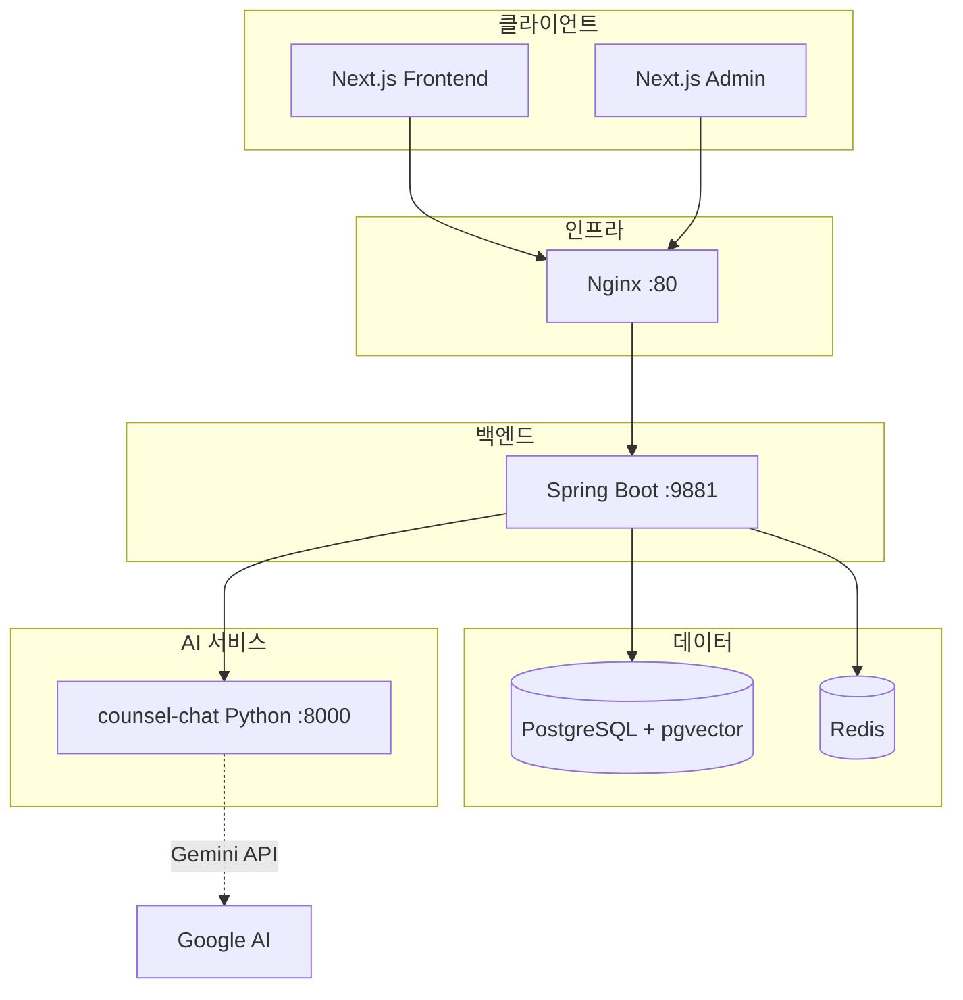
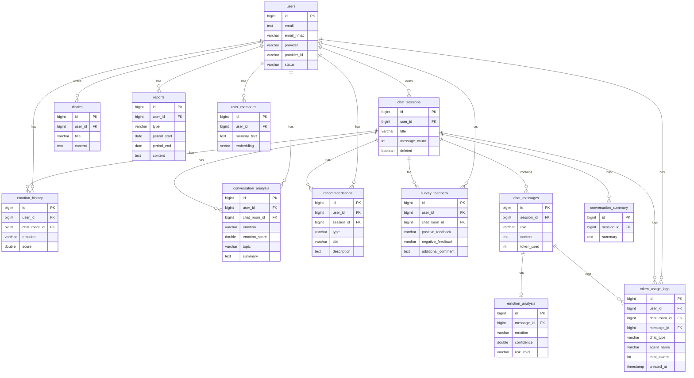

# AI 심리상담 앱 백엔드 포트폴리오

---

## 목차

1. [프로젝트 개요](#1-프로젝트-개요)
2. [담당 역할](#2-담당-역할)
3. [문제 정의 및 기획 배경](#3-문제-정의-및-기획-배경)
4. [핵심 기능](#4-핵심-기능)
5. [기술 스택](#5-기술-스택)
6. [시스템 아키텍처](#6-시스템-아키텍처)
7. [ERD / 도메인 설계](#7-erd--도메인-설계)
8. [API 설계](#8-api-설계)
9. [핵심 구현 내용](#9-핵심-구현-내용)
10. [트러블슈팅](#10-트러블슈팅)
11. [성능 / 운영 / 보안](#11-성능--운영--보안)
12. [프로젝트 결과 및 회고](#12-프로젝트-결과-및-회고)
13. [면접 예상 질문](#13-면접-예상-질문)

---

## 1. 프로젝트 개요

### 서비스 한 줄 소개

AI 챗봇과 대화를 통해 감정을 정리하고 심리적 지원을 받을 수 있는 웹 기반 상담 서비스.

### 해결하려는 문제

- **접근성**: 전문 상담사 예약·비용 부담 없이 언제든 감정을 정리하고 싶은 사용자 니즈
- **연속성**: 일회성 대화가 아닌, 일기·상담·리포트가 연결된 자기 이해 흐름 제공
- **프라이버시**: 익명 대화 모드로 저장 없이 체험 가능한 진입 장벽 완화

### 주요 사용자

- 일상적 스트레스·감정 정리가 필요한 일반 사용자
- 상담 전 사전 정리나 기록을 원하는 사용자
- 비로그인 체험 후 회원 전환을 고려하는 사용자

### 핵심 가치

- **데이터 민감성 인식**: 상담 내용은 개인정보보호법상 민감정보에 준하므로 저장·접근·삭제 정책을 엄격히 설계
- **AI 안정적 연동**: 외부 AI 서비스 장애 시에도 사용자 메시지는 보존하고, fallback 응답으로 UX 저하 최소화

### 프로젝트 기간

- 2025년 1월 ~ 현재 (진행 중)

### 프로젝트 형태

- 개인 프로젝트 (백엔드 전담, 프론트·AI 엔진은 별도 모듈 참조)

### 내 역할과 기여 범위

- 백엔드 API 설계·구현 전반
- 인증/인가, AI 연동, DB 설계, 배포 인프라 구성
- 관리자 기능 및 KPI 대시보드 백엔드 설계
- 프론트 디자인/개발

---

## 2. 담당 역할

### 직접 수행한 업무

| 영역 | 내용 |
|------|------|
| **기획** | 기획서 문서 작성 후 API·DB 스키마 설계에 반영 |
| **프론트** | API 명세 기반으로 프론트 개발 |
| **백엔드 설계/구현** | Spring Boot 기반 REST API, JPA 엔티티·Repository, 서비스 레이어 설계 |
| **인증/인가** | OAuth2 소셜 로그인(카카오·네이버·구글), JWT 발급·검증, 관리자 ID/PW 로그인(BCrypt) |
| **AI 연동** | counsel-chat(Python) HTTP/SSE 호출, 컨텍스트(Short/Summary/Long-term Memory) 수집·전달 |
| **배포/운영** | Docker Compose, Nginx 리버스 프록시, PostgreSQL init-db 스크립트 |
| **관리자 기능** | 회원·채팅·일기·리포트·설문·토큰·쿠폰·입장문·인사말 CRUD, KPI 대시보드 API 설계 |
| **데이터 보호** | 이메일 AES-256 암호화, HMAC 검색, 상담 데이터 소유권 검증 |

---

## 3. 문제 정의 및 기획 배경

### 왜 이 서비스를 만들었는지

- AI 대화형 서비스로 24시간 접근 가능한 감정 정리 도구 제공

### 기존 방식의 불편함

- 전문 상담: 비용·심리적 부담
- 일반 일기: 피드백·맥락 연결 부족
- 단순 챗봇: 이력·리포트·일기와의 연계 부족

### AI 심리상담 특성상 해결하려 한 사용자 문제

- **감정 기록**: 일기로 매일 기록
- **상담**: AI와 대화로 정리·피드백
- **리포트**: 일일/주간 상담 요약으로 자기 이해 증진

이 세 가지가 하나의 흐름으로 연결되어야 "기록 → 대화 → 정리"가 자연스럽게 이어짐.

### 백엔드 관점의 시스템 문제 해석

- **외부 의존성**: AI 서비스 장애 시에도 사용자 메시지·세션은 유지
- **민감 데이터**: 상담·일기·리포트는 접근 제어·암호화·보관 정책 필요
- **토큰 비용**: AI 호출당 토큰 사용량 관리 및 사용량 제한

---

## 4. 핵심 기능

### 사용자 흐름 기준 정리

```
소셜 로그인 → 세션 생성 → 상담 대화(SSE 스트리밍)
    → 일기 작성 → 감정 타임라인 조회 → 리포트 생성
```

### 4.1 회원가입/로그인

| 항목 | 내용 |
|------|------|
| **기능** | 카카오·네이버·구글 OAuth2, 최초 로그인 시 자동 가입 |
| **백엔드 책임** | 조회/생성, JWT 발급, 이메일 암호화 저장 |
| **엔티티** | MemberEntity (users) |
| **API** | POST /api/v1/auth/social/login |

### 4.2 사용자 정보 관리

| 항목 | 내용 |
|------|------|
| **기능** | 내 정보 조회 |
| **백엔드 책임** | JWT 기반 userId 추출, 본인 데이터만 반환 |
| **API** | GET /api/v1/users/me |

### 4.3 AI 상담 채팅

| 항목 | 내용 |
|------|------|
| **기능** | 세션별 대화, SSE 스트리밍 응답 |
| **백엔드 책임** | Short/Summary/Long-term Memory 수집 → AI 요청 → assistant 메시지·감정·추천·요약 저장 |
| **엔티티** | ChatSessionEntity, ChatMessageEntity, ConversationSummaryEntity, EmotionAnalysisEntity, RecommendationEntity |
| **API** | POST /api/v1/chat/messages, GET /api/v1/chat/messages/{messageId}/stream |

### 4.4 상담 세션 관리

| 항목 | 내용 |
|------|------|
| **기능** | 세션 생성/삭제/제목 수정, 목록 조회 |
| **백엔드 책임** | userId 기반 소유권 검증, soft delete(deleted 플래그) |
| **API** | POST/GET/PATCH/DELETE /api/v1/chat/sessions |

### 4.5 상담 메시지 저장/조회

| 항목 | 내용 |
|------|------|
| **기능** | 세션별 메시지 목록 조회 |
| **백엔드 책임** | 세션 소유권 확인 후 메시지 반환 |
| **API** | GET /api/v1/chat/messages/{sessionId} |

### 4.6 상담 리포트 생성/조회

| 항목 | 내용 |
|------|------|
| **기능** | 일일(DAILY)/주간(WEEKLY) 리포트 생성, 목록·생성 가능 여부 조회 |
| **백엔드 책임** | conversation_analysis 집계 → AI 리포트 생성 API 호출 → reports 저장 |
| **엔티티** | ReportEntity, ConversationAnalysisEntity |
| **API** | GET/POST /api/v1/reports, GET /api/v1/reports/can-generate |

### 4.7 감정 일기 작성/조회

| 항목 | 내용 |
|------|------|
| **기능** | 일기 CRUD, 상세에서 해당 날짜 감정 타임라인 표시 |
| **백엔드 책임** | 하루 1편 제한, emotion_history 기반 타임라인 조회 |
| **엔티티** | DiaryEntity, EmotionHistoryEntity |
| **API** | GET/POST/PUT/DELETE /api/v1/diaries, GET /api/v1/emotion-history |

### 4.8 관리자 기능

| 항목 | 내용 |
|------|------|
| **기능** | 대시보드/KPI, 회원·채팅·일기·리포트·설문·토큰·쿠폰·입장문·인사말 관리 |
| **백엔드 책임** | ADMIN 역할 검증, /api/admin/* 전용 라우팅 |
| **API** | GET/POST/PATCH/DELETE /api/admin/* |

### 4.9 기타

- **익명(비저장) 채팅**: DB 저장 없이 토큰만 차감, EphemeralStreamStore로 스트리밍 컨텍스트 임시 보관
- **비로그인 체험**: preview API, DB/세션/토큰 저장 없음
- **토큰 시스템**: 잔액 조회, 사용/충전 이력, 쿠폰 사용

---

## 5. 기술 스택

| 영역 | 기술 | 선택 이유 |
|------|------|-----------|
| **Backend** | Spring Boot 3.5, Java 21 | LTS, WebFlux(WebClient)로 비동기 HTTP/SSE 호출 |
| **Database** | PostgreSQL 16 + pgvector | 관계형 + 벡터 검색(Long-term Memory) 단일 DB로 운영 |
| **캐시** | Redis | Short Memory(세션별 최근 메시지) TTL 관리 |
| **인증** | Spring Security, OAuth2 Client, JWT(jjwt) | 소셜 로그인 + API용 Stateless JWT |
| **AI 연동** | WebClient, SSE | counsel-chat(Python) HTTP/스트리밍 호출 |
| **배포** | Docker Compose, Nginx | 로컬·운영 환경 통일, 리버스 프록시로 API·OAuth2 라우팅 |
| **암호화** | AES-256-GCM, HMAC-SHA256 | 이메일 암호화, 검색용 HMAC |

---

## 6. 시스템 아키텍처

### 전체 구조



### 주요 요청 흐름

#### 인증 흐름

```
클라이언트 → /oauth2/authorization/kakao → Spring OAuth2 → 카카오 인가
→ /login/oauth2/code/kakao → Spring → JWT 발급 → 클라이언트 저장
```

#### 상담 흐름 (스트리밍)

```
1. POST /api/v1/chat/messages { sessionId, message }
   → 사용자 메시지 DB 저장 → messageId 반환

2. GET /api/v1/chat/messages/{messageId}/stream
   → Short/Summary/Long-term Memory 수집 → AiRequest 생성
   → counsel-chat /chat/stream 호출 (SSE)
   → Python → Spring → 클라이언트로 chunk 전달
   → done 이벤트 시 assistant 메시지·감정·추천·요약 저장
```

#### 리포트 생성 흐름

```
POST /api/v1/reports/generate { type: "DAILY" }
→ conversation_analysis 기간 조회
→ 감정·주제·요약 집계
→ counsel-chat /report 호출 → Markdown 본문 수신
→ reports 테이블 upsert
```

---

## 7. ERD / 도메인 설계

### 핵심 엔티티 관계



### 설계 판단 근거

| 설계 | 이유 |
|------|------|
| **세션·메시지 분리** | 세션 단위 목록/삭제, 메시지 단위 페이지네이션·스트리밍 분리 |
| **리포트 독립 엔티티** | 일일/주간별 기간 고정, AI 생성 본문 저장, 동일 기간 재생성 시 upsert |
| **일기·상담 이력 분리** | 일기는 사용자 작성, 상담은 AI 대화 기반. 감정 타임라인은 emotion_history로 통합 |
| **user_memories (pgvector)** | Long-term Memory 검색을 위해 임베딩 벡터 저장, counsel-chat /embed 호출 결과 활용 |
| **conversation_analysis** | 상담별 감정·주제·요약을 리포트 생성 시 집계용으로 분리 저장 |

---

## 8. API 설계

### 대표 API 목록

| Method | Path | 설명 | 인증 |
|--------|------|------|------|
| POST | /api/v1/auth/social/login | 소셜 로그인, JWT 발급 | X |
| GET | /api/v1/users/me | 내 정보 조회 | O |
| POST | /api/v1/chat/sessions | 세션 생성 | O |
| GET | /api/v1/chat/sessions | 세션 목록 | O |
| PATCH | /api/v1/chat/sessions/{id} | 세션 제목 수정 | O |
| DELETE | /api/v1/chat/sessions/{id} | 세션 삭제 | O |
| POST | /api/v1/chat/messages | 메시지 전송 | O |
| GET | /api/v1/chat/messages/{messageId}/stream | SSE 스트리밍 | O |
| GET | /api/v1/chat/messages/{sessionId} | 메시지 목록 | O |
| POST | /api/v1/chat/messages/ephemeral | 비저장 채팅 준비 | O |
| GET | /api/v1/chat/messages/ephemeral/{streamKey}/stream | 비저장 스트리밍 | O |
| POST | /api/v1/chat/messages/preview | 비로그인 체험 | X |
| GET | /api/v1/tokens | 토큰 잔액 | O |
| GET | /api/v1/diaries | 일기 목록(페이지네이션) | O |
| GET | /api/v1/emotion-history | 감정 타임라인 | O |
| GET | /api/v1/reports | 리포트 목록 | O |
| POST | /api/v1/reports/generate | 리포트 생성 | O |
| GET | /api/v1/entrance | 입장문 조회 | X |
| POST | /api/admin/auth/login | 관리자 로그인 | X |
| GET | /api/admin/** | 관리자 API | ADMIN |

### 요청/응답 예시

**POST /api/v1/auth/social/login**

```json
// Request
{ "provider": "kakao", "accessToken": "..." }

// Response
{
  "accessToken": "eyJ...",
  "user": { "id": 1, "email": "user@email.com", "nickname": "user" }
}
```

**POST /api/v1/chat/messages**

```json
// Request
{ "sessionId": 1, "message": "요즘 너무 힘들어요" }

// Response
{ "messageId": 10 }
```

**GET /api/v1/chat/messages/{messageId}/stream** (SSE)

```
event: chunk
data: {"event":"chunk","delta":"무슨"}

event: chunk
data: {"event":"chunk","delta":" 일이"}

event: done
data: {"event":"done","answer":"...","emotion":"...","riskLevel":"LOW"}
```

### 공통 응답·예외

- 성공: 200 + JSON body
- 검증 실패: 400 + `{ "message": "..." }`
- 비즈니스 예외(예: 리포트 생성 불가): 422 + `{ "message": "..." }`
- 인증 실패: 401
- 권한 부족: 403

### RESTful·버전 전략

- Base path `/api/v1`로 버전 관리
- 리소스 중심 URL (sessions, messages, diaries, reports)
- 관리자 API는 `/api/admin`으로 분리

---

## 9. 핵심 구현 내용

### 9.1 인증/인가 구조

**배경**: 소셜 로그인 + API용 Stateless 인증, 관리자 전용 ID/PW 필요.

**설계**:
- OAuth2 Client로 카카오·네이버·구글 인가 후 사용자 정보 조회
- 최초 로그인 시 MemberEntity 생성, JWT(subject=userId, role) 발급
- `JwtAuthenticationFilter`에서 Bearer 토큰 검증 후 SecurityContext 설정
- `/api/admin/**`는 `hasRole("ADMIN")`으로 관리자 전용

**구현**:
- `JwtUtil`: HMAC-SHA256 서명, 만료 시간 설정
- `SecurityConfig`: permitAll(entrance, preview, auth), authenticated(/api/v1), hasRole(ADMIN)(/api/admin)
- 관리자: admin_users 테이블, BCrypt 비밀번호 해시

**기대 효과**: 세션 없이 확장 가능한 인증, 역할 기반 접근 제어.

---

### 9.2 상담 세션·메시지 저장 구조

**배경**: 세션 단위 대화 관리, 메시지 20개 이상 시 요약 갱신으로 토큰 절약.

**설계**:
- ChatSessionEntity: user_id, title, message_count, deleted(soft delete)
- ChatMessageEntity: session_id, role(user/assistant/system), content, token_used
- ConversationSummaryEntity: session_id, summary (message_count ≥ 20 시 갱신)

**구현**:
- `ChatSessionService.isOwner(sessionId, userId)`로 모든 메시지/세션 API에서 소유권 검증
- 메시지 저장 시 `incrementMessageCount`, 요약 갱신 임계값 도달 시 conversation_summary 저장

**기대 효과**: 세션별 대화 이력 관리, 요약 기반 컨텍스트로 AI 토큰 비용 절감.

---

### 9.3 AI 응답 생성 및 대화 문맥 유지

**배경**: AI 호출 시 전체 이력을 보내면 토큰 비용 증가. Short/Summary/Long-term Memory로 문맥 유지.

**설계**:
- **Short Memory**: Redis, 세션별 최근 10개 메시지, TTL 7일
- **Summary**: conversation_summary 테이블, 20메시지마다 갱신
- **Long-term Memory**: user_memories(pgvector), 임베딩 검색으로 관련 메모리 반환

**구현**:
- `ChatContextService`: Redis key `counsel:session:{id}:recent`, 없으면 DB에서 로드 후 Redis 채움
- `ChatMessageService.buildContextRequest`: summary + recentMessages + relevantMemories → AiRequest
- `UserMemoryService`: counsel-chat /embed 호출 후 pgvector 유사도 검색

**기대 효과**: 토큰 사용량 감소, 장기 대화에서도 맥락 유지.

---

### 9.4 SSE 스트리밍 및 한글 처리

**배경**: Python /chat/stream이 SSE로 스트리밍. DataBuffer 경계에서 한글 깨짐 발생.

**설계**:
- WebClient로 bodyToFlux(DataBuffer) 수신
- 바이트 단위로 누적 후 `\n\n` 구분자 기준 완성된 이벤트만 UTF-8 디코딩
- chunk/done 이벤트 파싱 후 클라이언트 SseEmitter로 전달

**구현**:
- `ChatStreamService`: ByteArrayOutputStream으로 rawBuf 관리, `indexOfDoubleLF`로 이벤트 분리
- done 시 onDone 콜백에서 assistant 메시지·감정·추천·요약 저장
- `AsyncSecurityContextRestoreFilter`: 비동기 스트림에서 SecurityContext 유지

**기대 효과**: 한글 깨짐 제거, 스트리밍 완료 후 DB 저장 보장.

---

### 9.5 상담 리포트 생성 방식

**배경**: 일일/주간 리포트를 AI가 생성. conversation_analysis 기반 집계 필요.

**설계**:
- conversation_analysis에서 기간별 감정·주제·요약 집계
- counsel-chat /report에 type, period, emotions, topics, summaries 전달
- AI 실패 시 fallback Markdown 생성
- (user_id, type, period_start) UNIQUE로 동일 기간 재생성 시 upsert

**구현**:
- `ReportService.generate`: 분석 데이터 조회 → 감정/주제/요약 집계 → AiWebClient.generateReport
- `buildFallbackContent`: AI 실패 시 수동 Markdown 생성
- `WeeklyReportScheduler`: 주간 리포트 자동 생성(선택)

**기대 효과**: 상담 이력 기반 맞춤 리포트, AI 장애 시에도 기본 리포트 제공.

---

### 9.6 익명(비저장) 채팅

**배경**: DB 저장 없이 대화만 진행. 토큰만 차감.

**설계**:
- POST /ephemeral: 메시지 수신 → AI 호출 준비 → streamKey 반환
- GET /ephemeral/{streamKey}/stream: streamKey로 컨텍스트 조회 후 스트리밍
- EphemeralStreamStore: ConcurrentHashMap, TTL 120초, put 시 만료 항목 정리

**구현**:
- `EphemeralChatService`: 토큰 차감, AiWebClient 호출, EphemeralStreamContext 저장
- `EphemeralStreamStore.put/getAndRemove`: streamKey 기반 임시 보관
- 120초 내 스트리밍 연결하지 않으면 컨텍스트 소멸

**기대 효과**: 저장 부담 없이 체험 가능, 토큰 사용량만 추적.

---

## 10. 트러블슈팅

### 10.1 SSE 스트리밍 시 한글 깨짐

| 항목 | 내용 |
|------|------|
| **문제** | Python AI 서비스 SSE 응답을 Spring WebClient로 수신 시, 중간에 한글이 깨져 출력됨 |
| **원인** | DataBuffer가 청크 단위로 도착할 때 멀티바이트 UTF-8 문자가 버퍼 경계에 걸리면 `DataBuffer.toString(UTF_8)` 호출 시 잘림 |
| **해결** | 원시 바이트를 ByteArrayOutputStream에 누적하고, `\n\n`(0x0A 0x0A) 구분자로 완성된 SSE 이벤트만 추출한 뒤 UTF-8 디코딩 |
| **결과** | 한글 깨짐 없이 스트리밍 동작 |
| **배운 점** | 스트리밍 프로토콜 처리 시 바이트 경계를 고려해야 함. 문자열 변환은 완성된 단위에서만 수행 |

---

### 10.2 비동기 SSE에서 SecurityContext 소실

| 항목 | 내용 |
|------|------|
| **문제** | GET /{messageId}/stream 호출 시 WebClient 구독 스레드에서 SecurityContext가 null, userId 조회 불가 |
| **원인** | SecurityContext는 ThreadLocal 기반. WebClient의 reactor 스레드에서는 요청 스레드의 Context가 전달되지 않음 |
| **해결** | `RequestAttributeSecurityContextRepository`로 요청 속성에 SecurityContext 저장, `AsyncSecurityContextRestoreFilter`에서 비동기 콜백 실행 전 `SecurityContextHolder.setContext(securityContext)` 호출 |
| **결과** | 스트리밍 완료 시 onDone 콜백에서 userId 기반 DB 저장 정상 동작 |
| **배운 점** | 비동기 처리 시 SecurityContext 전파를 명시적으로 설계해야 함 |

---

### 10.3 AI 서비스 호출 실패 시 사용자 메시지 유지

| 항목 | 내용 |
|------|------|
| **문제** | AI 호출 타임아웃·500 에러 시 사용자가 보낸 메시지도 함께 롤백되거나 손실될 위험 |
| **원인** | 사용자 메시지 저장과 AI 호출을 하나의 트랜잭션으로 묶으면, AI 실패 시 전체 롤백 |
| **해결** | 사용자 메시지를 먼저 저장·커밋한 뒤 AI 호출. AI 실패 시 assistant 메시지는 저장하지 않고, 사용자 메시지만 유지. 클라이언트에는 에러 응답 |
| **결과** | AI 장애 시에도 사용자 입력은 보존, 재시도 가능 |
| **배운 점** | 외부 서비스 호출은 트랜잭션 경계 밖에서 처리하고, 최소한의 데이터는 먼저 확정하는 것이 안전함 |

---

### 10.4 익명 채팅 streamKey 만료

| 항목 | 내용 |
|------|------|
| **문제** | POST /ephemeral 후 GET /ephemeral/{streamKey}/stream 호출 전에 사용자가 지연되면 "Invalid or expired stream key" 발생 |
| **원인** | EphemeralStreamStore TTL 120초. 네트워크 지연·탭 전환 등으로 2분 초과 시 컨텍스트 삭제 |
| **해결** | TTL을 120초로 유지하되, 클라이언트에서 POST 직후 바로 GET 연결하도록 안내. 만료 시 400 + 명확한 메시지 반환 |
| **결과** | 정상 플로우에서는 문제 없음. 만료 시 사용자에게 "다시 시도해 주세요" 안내 |
| **배운 점** | 임시 상태 저장 시 TTL과 사용자 플로우를 함께 고려해야 함 |

---

### 10.5 OAuth2 redirect_uri 환경별 불일치

| 항목 | 내용 |
|------|------|
| **문제** | 로컬(localhost)에서 등록한 redirect_uri로 개발 후, Nginx 뒤 배포 환경에서 redirect_uri mismatch 에러 |
| **원인** | Spring이 redirect_uri를 요청의 scheme+host 기반으로 생성. Nginx 프록시 뒤에서는 X-Forwarded-Proto/Host 전달 필요 |
| **해결** | `forward-headers-strategy: framework` 설정, Nginx에서 `X-Forwarded-Proto`, `X-Forwarded-Host` 전달. `OAUTH2_BASE_URL` 환경변수로 배포 URL 지정 |
| **결과** | 로컬·운영 환경 모두 소셜 로그인 정상 동작 |
| **배운 점** | 리버스 프록시 환경에서는 forwarded 헤더와 base URL 설정이 필수 |

---

## 11. 성능 / 운영 / 보안

### 성능

| 항목 | 내용 |
|------|------|
| **인덱스** | chat_sessions(user_id, last_message_at), chat_messages(session_id, created_at), reports(user_id, type), diaries(user_id, created_at), emotion_history(user_id, created_at) 등 |
| **페이지네이션** | 일기 목록, 토큰 사용 이력 등 `PageRequest` 적용 |
| **캐시** | Redis Short Memory로 세션별 최근 메시지 캐싱, DB 조회 감소 |
| **비동기** | WebClient로 AI 호출, 블로킹 최소화 |

### 운영

| 항목 | 내용 |
|------|------|
| **Health Check** | PostgreSQL `pg_isready` 기반 healthcheck, backend는 postgres healthy 후 기동 |
| **배포** | Docker Compose, init-db 스크립트로 스키마 초기화 |
| **로그** | Hibernate SQL debug(개발), 운영에서는 info 수준 권장 |
| **리버스 프록시** | Nginx로 /api, /oauth2, /login/oauth2/code 라우팅, proxy_buffering off로 SSE 정상 전달 |

### 보안

| 항목 | 내용 |
|------|------|
| **인증/인가** | JWT 검증, 세션·메시지·일기·리포트 API에서 userId 기반 소유권 검증 |
| **비밀번호** | 관리자 BCrypt 단방향 암호화 |
| **이메일** | AES-256-GCM 암호화, HMAC-SHA256으로 검색(동등 검색만 가능) |
| **민감 데이터** | 상담·일기·리포트는 본인만 조회. 관리자 API는 ADMIN 역할 필수 |
| **환경 변수** | JWT_SECRET, APP_CRYPTO_DATA_KEY_BASE64, APP_CRYPTO_EMAIL_HMAC_KEY_BASE64 등 운영 시 반드시 설정 |
| **탈퇴 정책** | UserStatus WITHDRAWN, 향후 개인정보 삭제·익명화 정책 적용 예정 |

---

## 12. 프로젝트 결과 및 회고

### 구현 완료 범위

- 소셜 로그인, JWT 인증
- 채팅 세션·메시지 CRUD, SSE 스트리밍
- 익명(비저장) 채팅, 비로그인 체험
- 토큰 시스템, 쿠폰
- 일기 CRUD, 감정 타임라인
- 상담 리포트(일일/주간) 생성·조회
- 관리자 회원·채팅·일기·리포트·설문·토큰·쿠폰·입장문·인사말 관리
- Docker Compose 기반 배포

### 실제 동작 가능한 사용자 플로우

- 비로그인 → preview 체험 → 소셜 로그인 → 세션 생성 → 상담(스트리밍) → 일기 작성 → 리포트 생성 → 관리자 대시보드 조회

### 기술적으로 얻은 경험

- 외부 AI 서비스와 HTTP/SSE 연동, 장애 시 fallback 설계
- Redis·pgvector를 활용한 대화 문맥 관리
- OAuth2 + JWT 혼합 인증, 비동기 스레드에서 SecurityContext 전파
- 민감 데이터(이메일 암호화, 상담 데이터 접근 제어) 설계

### 아쉬운 점

- GlobalExceptionHandler 미구현. 예외별 HTTP 상태·메시지 통일 필요
- KPI 대시보드 설계 문서는 있으나, 일부 API는 미구현
- 결제(토큰 충전) 미구현, 쿠폰·관리자 조정만 가능

### 개선 예정

- GlobalExceptionHandler 도입, 공통 에러 응답 포맷
- KPI API 전면 구현, Redis 캐시 적용
- 탈퇴 시 상담·일기 데이터 익명화·삭제 정책

### 다음 단계 고도화

- 결제 연동(토큰 충전)
- kpi_daily_snapshots 등 집계 테이블로 대시보드 성능 개선
- 모니터링(APM, 로그 수집) 도입

---

## 13. 면접 예상 질문

1. **Short/Summary/Long-term Memory를 왜 이렇게 나눴는지? 각각의 역할과 토큰 절약 효과를 설명해 주세요.**

2. **SSE 스트리밍에서 한글이 깨졌던 원인과 해결 방법을 구체적으로 설명해 주세요.**

3. **AI 서비스 장애 시 사용자 경험을 어떻게 보장했는지?**

4. **상담 데이터가 민감정보에 준한다고 했는데, 접근 제어와 저장 정책을 어떻게 설계했는지?**

5. **OAuth2와 JWT를 함께 사용한 이유는? 세션 기반과 비교했을 때 장단점은?**

6. **EphemeralStreamStore를 Redis가 아닌 ConcurrentHashMap으로 구현한 이유는?**

7. **리포트 생성 시 AI 호출이 실패하면 어떻게 처리하는지?**

8. **관리자 API와 일반 사용자 API의 인가 차이를 어떻게 구현했는지?**

9. **pgvector를 사용한 Long-term Memory 검색 흐름을 설명해 주세요.**

10. **이 프로젝트에서 가장 어려웠던 기술적 결정은 무엇이었는지?**
