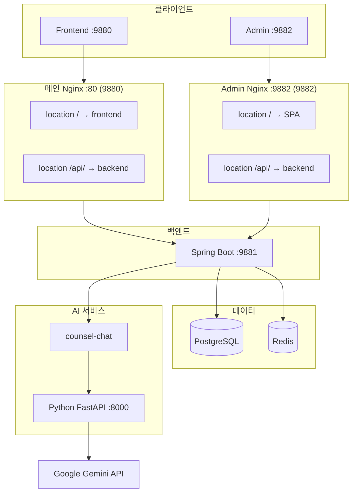
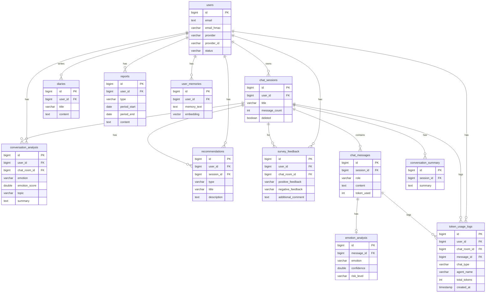

# AI 심리상담 앱 백엔드 포트폴리오
https://onoff-m.com/

---

## 목차

1. [프로젝트 개요](#1-프로젝트-개요)
2. [기술 스택](#2-기술-스택)
3. [시스템 아키텍처](#3-시스템-아키텍처)
4. [ERD / 도메인 설계](#4-erd--도메인-설계)
5. [트러블슈팅](#5-트러블슈팅)

---

## 1. 프로젝트 개요

### 서비스 한 줄 소개

AI 챗봇과 대화를 통해 감정을 정리하고 심리적 지원을 받을 수 있는 웹 기반 상담 서비스.

### 프로젝트 기간

- 2025년 1월 ~ 현재 (진행 중)

### 기여 범위

| 영역 | 내용 |
|------|------|
| **백엔드 설계/구현** | Spring Boot 기반 REST API, JPA 엔티티·Repository, 서비스 레이어 설계 |
| **인증/인가** | OAuth2 소셜 로그인(카카오·네이버·구글), JWT 발급·검증, 관리자 ID/PW 로그인(BCrypt) |
| **배포/운영** | Docker Compose, Nginx 리버스 프록시, PostgreSQL init-db 스크립트 |
| **관리자 기능** | 회원·채팅·일기·리포트·설문·토큰·쿠폰·입장문·인사말 CRUD, KPI 대시보드 API 설계 |
| **데이터 보호** | 이메일 AES-256 암호화, HMAC 검색, 상담 데이터 소유권 검증 |
| **AI 연동** | Python HTTP/SSE 호출, 컨텍스트(Short/Summary/Long-term Memory) 수집·전달 |
| **AI 서비스 개발** | Python FastAPI + Gemini 연동, Agent 오케스트레이션(Emotion→Safety→Therapy→Recommendation), 리포트/인사말 생성 API |

---

## 2. 기술 스택

| 영역 | 기술 | 선택 이유 |
|------|------|-----------|
| **Backend** | Spring Boot 3.5, Java 21 | LTS, WebFlux(WebClient)로 비동기 HTTP/SSE 호출 |
| **Database** | PostgreSQL 16 + pgvector | 관계형 + 벡터 검색(Long-term Memory) 단일 DB로 운영 |
| **캐시** | Redis | Short Memory(세션별 최근 메시지) TTL 관리 |
| **인증** | Spring Security, OAuth2 Client, JWT(jjwt) | 소셜 로그인 + API용 Stateless JWT |
| **AI 연동** | WebClient, SSE | counsel-chat(Python) HTTP/스트리밍 호출 |
| **배포** | Docker Compose, Nginx | 로컬·운영 환경 통일, 리버스 프록시로 API·OAuth2 라우팅 |
| **암호화** | AES-256-GCM, HMAC-SHA256 | 이메일 암호화, 검색용 HMAC |

---

## 3. 시스템 아키텍처

### 전체 구조

---

## 4. ERD / 도메인 설계

### 핵심 엔티티 관계

### 설계 판단 근거

| 설계 | 이유 |
|------|------|
| **세션·메시지 분리** | 세션 단위 목록/삭제, 메시지 단위 페이지네이션·스트리밍 분리 |
| **리포트 독립 엔티티** | 일일/주간별 기간 고정, AI 생성 본문 저장, 동일 기간 재생성 시 upsert |
| **일기·상담 이력 분리** | 일기는 사용자 작성, 상담은 AI 대화 기반. 감정 타임라인은 emotion_history로 통합 |
| **user_memories (pgvector)** | Long-term Memory 검색을 위해 임베딩 벡터 저장, counsel-chat /embed 호출 결과 활용 |
| **conversation_analysis** | 상담별 감정·주제·요약을 리포트 생성 시 집계용으로 분리 저장 |

---

## 5. 트러블슈팅

---
